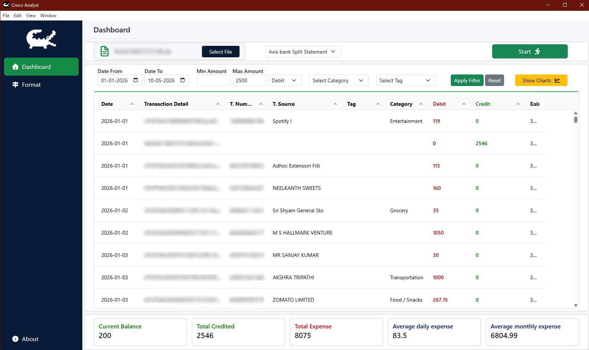
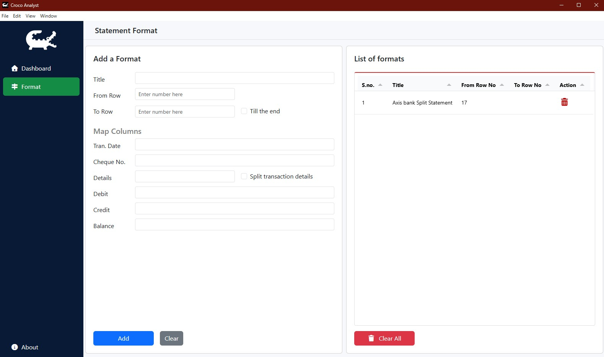
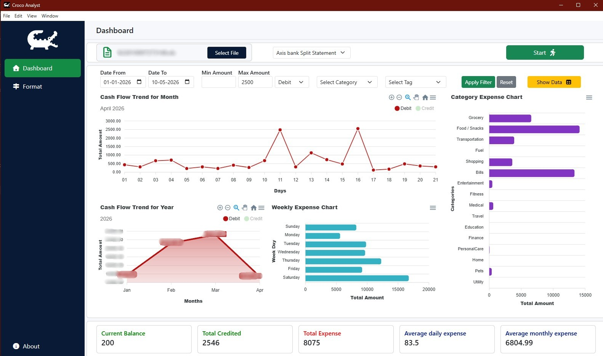

# Croco Analyst

A desktop-based bank statement analysis application built using Electron.js.

Croco Analyst helps users import Excel bank statements, map transaction columns, filter data, and analyze transactions, view the insigts with charts through a fast desktop interface.

---

# Features

## Statement Import
- Import `.xls` and `.xlsx` files
- Select custom row ranges before processing
- Dynamic Excel parsing
- Fast local processing

## Column Mapping System
- One-time mapping configuration
- Reuse formats for future statement imports
- Flexible handling for different bank statement formats

## Transaction Analysis
- Interactive transaction table
- Date range filtering
- Dynamic transaction filtering

---

# Tech Stack

- Electron.js
- JavaScript
- Bootstrap 5
- Tabulator
- XLSX
- ApexCharts
- Electron Store

---

# Screenshots

## Dashboard



## Mapping Configuration



---

## Transaction Analysis Table



---

# Installation

## Clone Repository

## Install Dependencies

```bash
npm install
```

## Run Application

```bash
npm start
```

## Build Application

```bash
npm run build
```

Packaged files will be generated inside:

```text
dist/
```

---

# Author

Ashutosh Singh

---

# License

This project is licensed under the MIT License.

---

# Feedback

Suggestions, improvements, and feedback are welcome.

